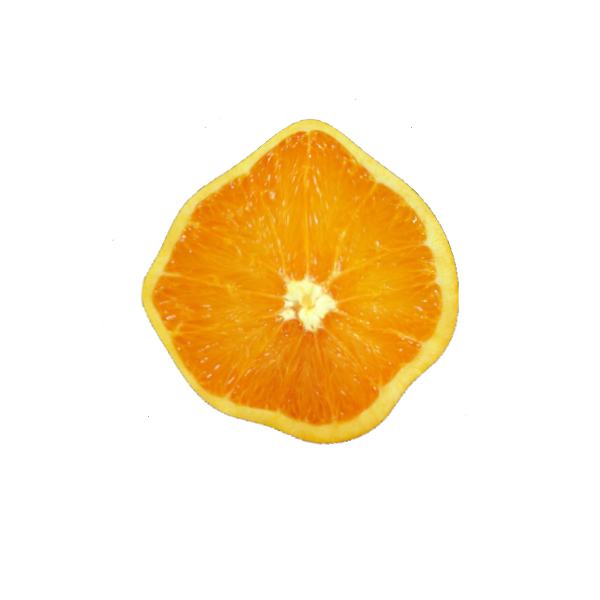
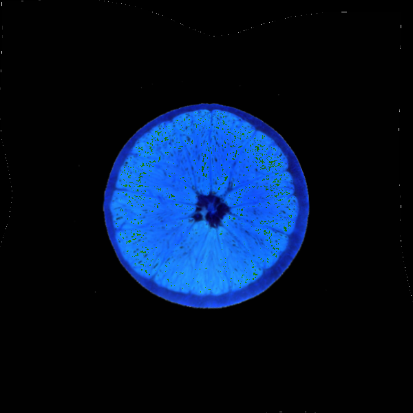

# CircularTransform

## Description

CircularTransform is a Python library designed to facilitate circular transformations on images. The library offers a collection of functions for generating original and transformed grids based on polar transformation, computing the difference in radius between an object contour and a circular shape, and performing piecewise warp transformations on images.

Due to its flexibility, the transformation function can be generalized to any function that provides a precise deformation field. Additionally, the difference between the input shape and output shape can be modified to suit any matching between two shapes in polar coordinates.

## TODO

- [ ] Generalized `compute_radius_difference` to any output shape.

